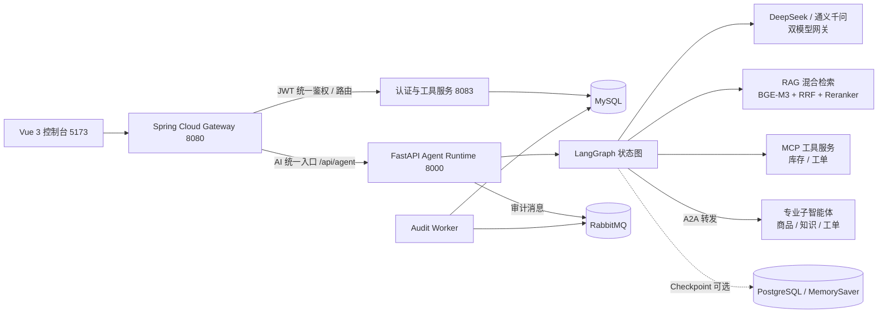

# 汇智通智能体协同中台

面向企业运营、客服与销售部门的智能体协同中台：Java 微服务承载业务与治理能力（用户、权限、工具、审计、网关），Python 承载 LangGraph 多智能体编排、RAG 混合检索与 MCP 工具接入，Vue 3 提供管理控制台与对话入口。中台通过 A2A 协议实现智能体间任务转发与协同汇总，一次接入即可复用全平台智能体能力。

## 系统架构



设计原则：Java 负责用户、权限、智能体/工具配置与调用治理；Python 负责 Prompt、模型调用、LangGraph 状态图、RAG、MCP 与 SSE 流式输出；前端一律经 Gateway 访问后端，不直接依赖 Python 内部实现；AI 服务通过统一内部协议被 Java 调用。

## 技术栈

- 前端：Vue 3、Vite、Element Plus、Pinia、SSE
- Java：Spring Boot 3、Spring Cloud Gateway、Spring Security + JWT、MyBatis-Plus、MySQL、RabbitMQ
- Python：FastAPI、LangGraph、LangChain、MCP、A2A、SSE
- AI 模型：DeepSeek API（主）、通义千问（降级）、BGE-M3（稠密 + 稀疏混合检索）、BGE-reranker-large（重排）、Milvus（可选向量库）
- 基础设施：Docker Compose、Nginx、RabbitMQ、Milvus / etcd / MinIO（可选）

## 目录结构

| 目录 | 说明 |
| --- | --- |
| `frontend/` | Vue 3 管理端与对话端（Vite + Element Plus） |
| `java/` | Spring Boot / Spring Cloud Alibaba 微服务（网关、工具服务） |
| `python/agent-runtime/` | FastAPI Agent Runtime：LangGraph 编排、RAG、MCP 客户端、A2A、审计 Worker |
| `mcp-servers/` | MCP 工具服务（库存查询、工单查询） |
| `deploy/` | Docker Compose 全栈部署、Dockerfile、基础设施编排 |
| `scripts/` | 本地一键启停脚本 |
| `docs/` | 架构、接口与设计文档 |

## 核心能力

- **LangGraph 多智能体编排**：意图分类 → 任务规划 → 并行扇出 → 结果校验 → 答案生成，SSE 流式输出节点执行进度
- **A2A 跨智能体协同**：客服智能体入口识别意图，LLM / 规则路由并行转发库存、知识、工单专业智能体，协同汇总统一答复
- **RAG 混合检索**：BGE-M3 稠密 + 稀疏向量 → RRF 融合 → BGE-reranker-large 重排，Milvus / 内存向量库自动切换
- **MCP 工具接入**：库存查询、工单查询等经 MCP 协议统一封装，支持注册、目录刷新与健康检查
- **工具授权（RBAC）**：按智能体类型与租户授权 / 撤销工具，未授权工具在对话中返回 FORBIDDEN，多租户资源隔离
- **JWT + 网关统一鉴权**：Gateway 统一校验并透传 `X-User-Id / X-Username / X-User-Role`，工具服务二次校验，绕过网关直连同样被拦截
- **用户管理与角色权限**：内置 ADMIN / OPERATOR / VIEWER 三角色，写操作按角色接口级强制校验
- **双模型网关**：DeepSeek 主模型 + 通义千问降级路由，主模型异常自动切换（`LLM_PROVIDER / LLM_FALLBACK` 可配）
- **调用审计**：RabbitMQ 异步落库 MySQL，MQ 故障自动降级直写，独立 Worker 消费并自动重连
- **多租户工作台**：租户级数据隔离（工具、授权、会话），同一前端按角色 / 租户展示不同视图

## 本地服务端口

| 服务 | 端口 | 说明 |
| --- | ---: | --- |
| Vue 管理控制台 | 5173 | http://localhost:5173 |
| Spring Cloud Gateway | 8080 | 统一入口 http://localhost:8080/api/... |
| Java Tool Service | 8083 | 登录、工具注册、授权管理 |
| Python Agent Runtime | 8000 | LangGraph 编排 / SSE / 健康检查 |
| RabbitMQ | 5673 / 15673 | 消息队列 / 管理台 |
| MySQL | 3307 | 业务库 `huizhitong` |
| Milvus（可选） | 19530 | 向量库，`RAG_VECTOR_STORE=milvus` 时启用 |

## 快速启动

### 方式一：Docker 一键部署（推荐）

前置：Docker Desktop 已运行。

```powershell
cd deploy
Copy-Item .env.example .env   # 填写 DEEPSEEK_API_KEY、QWEN_API_KEY
docker compose build
docker compose up -d
```

打开 http://localhost:5173，演示账号：

| 账号 | 密码 | 角色 |
| --- | --- | --- |
| admin | admin123 | 管理员（全量管理） |
| tenant1 | 123456 | 租户（租户工作台，数据隔离） |

停止 / 切回本地开发：

```powershell
docker compose -f deploy\docker-compose.yml down
powershell -ExecutionPolicy Bypass -File scripts\start-services.ps1
```

详见 [docs/docker-deploy.md](docs/docker-deploy.md)。

### 方式二：本地开发

1. 基础设施：`docker compose -f deploy/docker-compose.infra.yml up -d`（RabbitMQ；Milvus / etcd / MinIO 按需）
2. 敏感配置：复制 `scripts/env.local.ps1.example` 为 `scripts/env.local.ps1`，填写 API Key 与 MySQL 密码（该文件已 gitignore，不会入库）
3. Python 服务：`powershell -ExecutionPolicy Bypass -File scripts/start-services.ps1` 一键启动 RabbitMQ → Agent Runtime（8000）→ Audit Worker → Tool Service（8083）→ Gateway（8080）→ 前端（5173），日志输出到 `logs/`；停止用 `scripts/stop-services.ps1`
4. 单独启动 Java：`cd java; mvn -pl huizhitong-tool-service spring-boot:run`
5. 单独启动前端：`cd frontend; npm run dev`

## 配置说明（deploy/.env）

| 变量 | 说明 |
| --- | --- |
| `DEEPSEEK_API_KEY` / `QWEN_API_KEY` | 大模型 API Key，DeepSeek 主用、通义千问降级 |
| `LLM_PROVIDER` / `LLM_FALLBACK` | 默认模型与降级开关 |
| `MYSQL_ROOT_PASSWORD` / `MYSQL_PASSWORD` | MySQL root / 应用账号密码 |
| `JWT_SECRET` | JWT 签名密钥（网关与工具服务共享） |
| `EMBEDDING_MODEL_DIR` | 本地 BGE 模型目录（只读挂载进容器） |
| `RAG_VECTOR_STORE` | `memory`（默认，零依赖）或 `milvus`（需自建 Milvus 服务） |

## 演示链路

登录 → 网关鉴权 → 多智能体协同 → 工具授权管控 → 审计闭环，约 10 分钟的完整演示流程见 [docs/demo-a2a-auth.md](docs/demo-a2a-auth.md)。

## 文档索引

- [系统架构](docs/architecture.md)
- [智能体编排](docs/agent-orchestration.md)
- [A2A 跨智能体协同](docs/a2a-collaboration.md)
- [JWT 鉴权](docs/auth-jwt.md)
- [工具授权](docs/tool-grants.md)
- [RAG 向量检索](docs/rag-vector-store.md)
- [模型网关](docs/model-gateway.md)
- [调用审计](docs/call-audit.md)
- [A2A + 鉴权演示说明](docs/demo-a2a-auth.md)
- [Docker 部署](docs/docker-deploy.md)
- [Git 工作流](docs/git-workflow.md)
- [本地 ML 环境](docs/local-ml-env.md)

## 开发约定

- 主分支：`main`；集成分支：`develop`
- 功能分支：`feature/<module>-<feature>`，合并采用 `--no-ff`
- Commit 规范：`英文类型(英文模块): 中文说明`，例如 `feat(agent): 新增意图路由`
