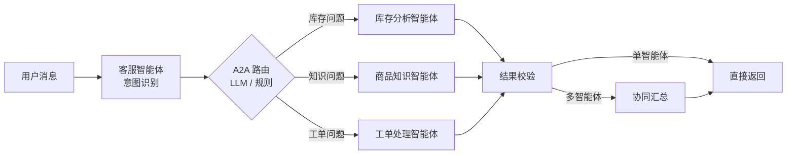

# A2A 跨智能体协同（A2A-lite）

## 设计

- **智能体注册表** `app/a2a/registry.py`：客服智能体（入口/协调）、库存分析智能体、
  商品知识智能体、工单处理智能体，各自声明能力描述、关键词与工具；
- **意图路由** `app/a2a/router.py`：`A2A_LLM_ROUTING=true` 时由大模型识别转发目标
  （JSON 数组），解析失败或模型不可用自动降级为注册表规则匹配，保证链路始终可用；
- **并行编排**：LangGraph 通过 `Send` 将多智能体任务并行扇出到专业智能体节点；
- **协同汇总** `synthesize_result` 节点：多智能体协作时由客服智能体用 LLM 汇总统一答复，
  汇总失败降级为直接拼接；单智能体场景不经过汇总节点。

## 调用流程

## 智能体链路示例

用户提问"查一下 P1002 库存，顺便问 E-1024 怎么处理"：

1. 客服智能体识别出两个意图（库存 + 知识）；
2. 并行转发给库存分析智能体与商品知识智能体；
3. 两个结果汇总成统一答复，`agent_chain = [customer_service, inventory, knowledge]`。

## 配置

| 变量 | 默认 | 说明 |
| --- | --- | --- |
| `A2A_LLM_ROUTING` | `false` | 是否启用 LLM 意图路由（关闭时用规则匹配） |

## 测试

`tests/test_a2a.py` 覆盖：规则匹配、LLM 路由 JSON 解析与降级、多智能体协同汇总降级、
智能体链路记录。