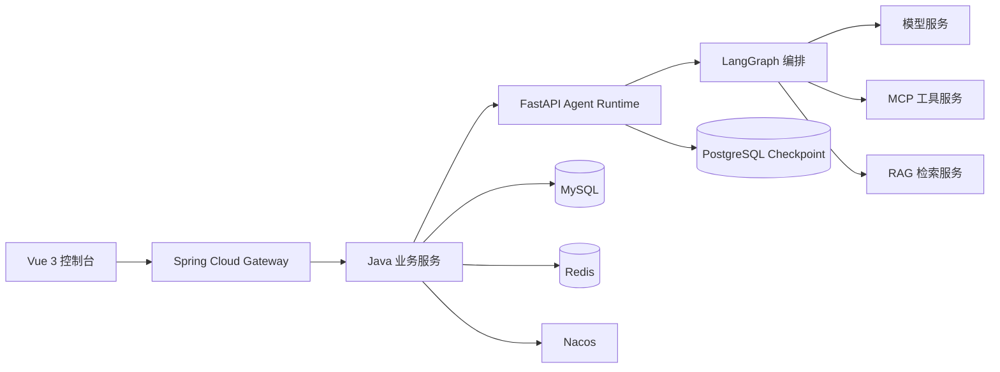

# 系统架构

## 服务边界

## 设计原则

- Java 负责用户、权限、智能体配置、工具配置、调用记录和服务治理。
- Python 负责 Prompt、模型调用、LangGraph 状态图、RAG 检索、MCP 调用和流式输出。
- 前端通过 Gateway 访问后端，不直接依赖 Python 内部实现。
- AI 服务通过统一内部协议被 Java 调用，避免业务逻辑散落在 Agent 代码中。

