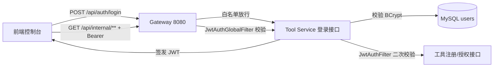

# JWT 登录与网关统一鉴权

## 链路

## 设计

- **登录**：Tool Service `POST /api/auth/login` 校验用户名/BCrypt 密码，
  签发 HS256 JWT（24h 有效，携带 uid/username/role）；
- **网关统一鉴权**：Gateway 全局过滤器校验所有请求的 Bearer Token，
  白名单放行 `/api/auth/login`、`/api/internal/health`、`/actuator/**`，
  校验通过后向下游透传 `X-User-Id / X-Username / X-User-Role` 请求头；
- **服务端二次校验**：Tool Service 的 Spring Security 过滤器再次校验 JWT，
  设置 SecurityContext 与角色，形成网关 + 服务双重防线；
- **角色权限矩阵**：内置 ADMIN / OPERATOR / VIEWER 三角色，工具服务按接口细分权限——
  用户管理仅 ADMIN；工具注册 / 授权写操作要求 ADMIN / OPERATOR；查询类接口登录即可。
- **用户初始化**：启动时自动建 `users` 表并初始化管理员
  （`ADMIN_USERNAME` / `ADMIN_INIT_PASSWORD`，默认 admin / admin123，密码 BCrypt 加密）。

## 配置

| 变量 | 默认 | 说明 |
| --- | --- | --- |
| `JWT_SECRET` | 开发默认值 | 网关与工具服务共享的签名密钥（≥32 字符） |
| `ADMIN_USERNAME` | `admin` | 初始管理员用户名 |
| `ADMIN_INIT_PASSWORD` | `admin123` | 初始管理员密码（仅首次初始化生效） |

## 用户管理接口（仅 ADMIN）

| 方法 | 路径 | 说明 |
| --- | --- | --- |
| `GET` | `/internal/users` | 用户列表（不含密码哈希） |
| `POST` | `/internal/users` | 新建用户：username / password / role（ADMIN/OPERATOR/VIEWER） |
| `PATCH` | `/internal/users/{id}/status?enabled=` | 启用 / 停用（不能停用自己） |
| `PATCH` | `/internal/users/{id}/password` | 管理员重置密码 `{newPassword}` |

## 角色权限矩阵

| 接口 | ADMIN | OPERATOR | VIEWER |
| --- | --- | --- | --- |
| 用户管理 `/internal/users/**` | ✅ | ❌ 403 | ❌ 403 |
| 工具注册 / 启停 `POST|PATCH /internal/tools**` | ✅ | ✅ | ❌ 403 |
| 授权新增 / 撤销 `POST|DELETE /internal/tools/grants` | ✅ | ✅ | ❌ 403 |
| 查询类（工具 / 授权 / 健康检查） | ✅ | ✅ | ✅ |
| 智能体对话 / 审计 / 知识库（Agent Runtime） | ✅ | ✅ | ✅ |

## 实测结果

- 登录（经 vite 代理 → 网关 → 工具服务）成功返回 token；
- 无 token 访问 `/api/internal/tools` → 网关 401；
- 携带 token → 200，返回工具列表；
- 白名单 `/api/internal/health` 无 token → 200；
- 直连工具服务无 token → Spring Security 403（双重防线）；
- 新建 OPERATOR / VIEWER 账号分级验证：OPERATOR 访问用户管理 403、工具写操作 200；VIEWER 授权写操作 403、查询 200；
- 停用账号后无法登录；管理员不能停用自己的账号。