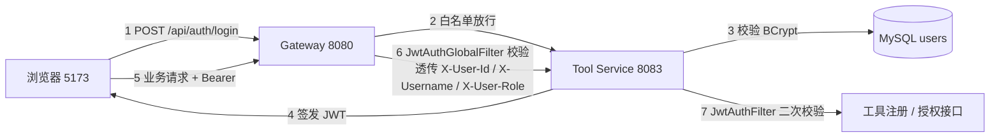
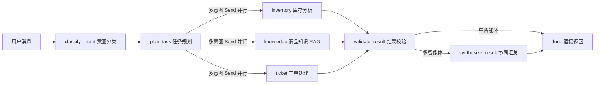

# A2A 协同 + 鉴权链路 演示说明

> 面向演示 / 面试汇报：围绕「登录 → 网关鉴权 → 多智能体协同 → 授权管控 → 审计闭环」一条主链路，约 10 分钟可完整走一遍。
> 本文为实操口径，所有步骤均为当前仓库已实测可跑通的能力；实现细节见 `docs/a2a-collaboration.md`、`docs/auth-jwt.md`、`docs/tool-grants.md`。

## 0. 演示准备

### 0.1 启动服务

执行一键启停脚本（或手动启动全部服务）：

```powershell
powershell -ExecutionPolicy Bypass -File scripts/start-services.ps1
```

### 0.2 服务清单

| 服务 | 端口 | 说明 |
| --- | --- | --- |
| 前端控制台 | 5173 | Vue 3 + Element Plus，演示主入口 |
| Gateway | 8080 | 统一鉴权与路由 |
| Tool Service | 8083 | 登录、工具注册、授权管理（MySQL） |
| Agent Runtime | 8000 | LangGraph 编排、RAG、MCP、SSE 流式 |
| Audit Worker | — | RabbitMQ 消费审计消息，异步入库 |
| RabbitMQ | 5672 / 15672 | 异步队列（15672 为管理台） |

### 0.3 演示账号与前置

- 默认账号：`admin / admin123`（`scripts/env.local.ps1` 中 `ADMIN_INIT_PASSWORD` 可覆盖，JWT 有效期 24h）。
- 预检：访问 `http://localhost:8080/api/internal/health`（白名单，无需 token）应返回 UP；打开 `http://localhost:5173` 后页面加载时也会自动做健康检查。
- 可选：在「知识库」页先录入一条 E-1024 故障处理文档，RAG 检索效果更直观。

### 0.4 两条访问路径（先分清，演示不迷路）

| 路径 | 入口 | 鉴权 | 用途 |
| --- | --- | --- | --- |
| A. 前端默认链路 | vite 代理 `/api/agent/*` → Agent Runtime 8000 | 内部链路 | 聊天 SSE 走这里 |
| B. 网关统一入口 | Gateway 8080 `/api/agents/**` → Agent Runtime | JWT 全局过滤 | 跨语言统一入口（当前为预留态，见 5.1） |

## 1. 鉴权链路演示（JWT + 网关统一鉴权 + 服务端二次校验）

### 1.1 链路图



### 1.2 分步演示（页面操作）

1. **未登录被拦截**：打开 `http://localhost:5173`，未登录时访问工具/授权页面会提示登录；直接请求 `GET http://localhost:8080/api/internal/tools`（不带 token）→ 网关返回 `401`。
2. **登录获取 JWT**：输入 `admin / admin123` 登录。Network 面板可见 `POST /api/auth/login` 返回 `token`；前端持久化到 localStorage（`hzt_token`），后续请求自动携带 `Authorization: Bearer <token>`。
3. **带 token 访问受保护接口**：登录后打开「工具管理」，工具列表正常加载（`GET /api/internal/tools` → 200）。网关校验通过后向下游透传 `X-User-Id / X-Username / X-User-Role`。
4. **白名单验证**：`GET http://localhost:8080/api/internal/health` 不带 token → `200`（健康检查不鉴权）。
5. **进阶：绕过网关直连**：`GET http://localhost:8083/internal/tools` 不带 token → `403 Forbidden`（Tool Service 的 Spring Security 二次防线，绕过网关也拿不到数据）。

### 1.3 curl 速查

```bash
# 1 登录，拿到 token
curl -s -X POST http://localhost:8080/api/auth/login \
  -H "Content-Type: application/json" \
  -d '{"username":"admin","password":"admin123"}'

# 2 无 token → 401
curl -i http://localhost:8080/api/internal/tools

# 3 带 token → 200（<TOKEN> 替换为返回值）
curl -i http://localhost:8080/api/internal/tools \
  -H "Authorization: Bearer <TOKEN>"

# 4 白名单 → 200
curl -i http://localhost:8080/api/internal/health

# 5 直连工具服务 → 403
curl -i http://localhost:8083/internal/tools
```

### 1.4 讲解要点

- **网关统一鉴权**：所有 `/api/**` 请求先过 `JwtAuthGlobalFilter`，白名单（login / health / actuator）外无 token 一律 401，业务服务无需各自重复做登录态校验；
- **认证信息透传**：网关解析 JWT 后透传 `X-User-Id / X-Username / X-User-Role`，下游据此做角色 / 租户级 RBAC；
- **服务端二次校验**：Tool Service 的 Spring Security 再验一次 JWT 并写入 SecurityContext，防止绕过网关直连；密钥由 `JWT_SECRET` 统一配置（网关与工具服务共享）。

## 2. A2A 跨智能体协同演示（LangGraph + MCP）

### 2.1 链路图



### 2.2 分步演示（页面操作）

1. 打开「智能体对话」，智能体选择「通用助手」，租户 ID 填 `1`；
2. 点击示例问题：**「查一下 P1002 库存，顺便问 E-1024 怎么处理」**；
3. 对话气泡内会实时滚动节点执行轨迹（SSE 逐节点推送）：

   ```
   🧭 意图分类 → 🗺️ 任务规划 → 📦 库存查询 + 📚 知识检索（并行） → ✅ 结果校验 → 🤝 协同汇总 → 完成
   ```

4. 观察要点：
   - **并行扇出**：任务规划后同时出现库存与知识两个分支（LangGraph `Send`），不是串行执行；
   - **协同汇总**：多智能体结果由客服智能体用 LLM 汇总成一条统一答复，链路记录 `agent_chain = [customer_service, inventory, knowledge]`；
   - **流式体验**：SSE 事件 `accepted → node* → done`，前端逐节点渲染，方便观察与排障。

### 2.3 补充场景

| 场景 | 操作 | 预期 |
| --- | --- | --- |
| 单智能体 | 只问「P1002 库存够吗？」 | 只走 inventory，结果校验后直接完成，不经过汇总节点 |
| 工单优先 | 「帮我创建 E-1024 的报修工单」 | 意图含工单关键词时 ticket 优先于 knowledge，避免 RAG 抢答 |
| 授权拦截 | 「查 P1002 库存」但租户未授权库存工具 | 返回 FORBIDDEN，不调用任何 MCP 工具（见第 3 节） |

curl 直连版（观察 SSE 原始事件）：

```bash
curl -N -X POST http://localhost:8000/internal/agents/stream \
  -H "Content-Type: application/json" \
  -d '{"agent_type":"assistant","conversation_id":"demo-a2a-001","message":"查一下 P1002 库存，顺便问 E-1024 怎么处理","tenant_id":1,"stream":true}'
```

### 2.4 讲解要点

- **LangGraph 状态图**：`classify → plan → 并行执行 → 校验 → 汇总` 拆成独立节点；条件路由（`route_plan`）单意图直行、多意图 `Send` 扇出；
- **A2A 意图路由**：`A2A_LLM_ROUTING=true` 时由 LLM 识别转发目标（JSON 数组），解析失败自动降级为注册表规则匹配，保证链路始终可用；
- **MCP 工具接入**：库存查询、建单 / 查单等经 MCP 协议统一封装，工具节点执行前先过 RBAC 授权检查；
- **降级体系**（体现健壮性，可逐条讲）：LLM 路由失败 → 规则匹配；主模型失败 → 双模型网关切换（DeepSeek ↔ 通义千问）；汇总失败 → 直接拼接；无 Milvus → 内存向量库；RabbitMQ 不可用 → 审计直写 MySQL。

## 3. 授权管控联动演示（RBAC 多租户）

1. 打开「授权管理」，智能体选「通用助手」（assistant）、租户填 `1`，先**撤销** `query_inventory` 授权，保留 `create_ticket`（注意：授权列表非空但不含目标工具时才会拦截；全部撤销等于"未配置管控"，不会被拦）；
2. 回「智能体对话」问「P1002 库存够吗？」→ 答复为「当前租户未授权库存工具，请联系管理员开通」，且不会触发任何 MCP 工具调用；
3. 回「授权管理」**补授权** `query_inventory`，再问同一问题 → 正常返回库存与补货建议（`STATUS=COMPLETED`）。

> 原理：Agent Runtime 执行工具节点前，向 Tool Service 拉取 `(agent_type, tenant_id)` 的已授权工具清单；工具调用与数据访问均按租户隔离。

## 4. 审计联动（可选加分项）

对话完成后打开「调用记录」页：可见本次调用 `agent_type / status / node_count / latency`。
RabbitMQ 在线时，审计消息经 worker 异步入库（管理台 `http://localhost:15672`），主链路零阻塞；断连自动重连，实在不可用再降级直写 MySQL。

## 5. 常见问题排查

| 现象 | 处理 |
| --- | --- |
| 5173 打不开 / 拒绝连接 | 前端未启动或端口占用：`npm run dev` 或重启一键脚本 |
| 登录报「用户名或密码错误」 | 确认 Gateway 8080 与 Tool Service 8083 已启动；默认账号 admin/admin123 |
| 接口 401 | token 过期（24h）或 `JWT_SECRET` 与登录时不一致 |
| 直连 8083 返回 403 | 正常，属服务端二次校验防线 |
| 对话返回 FORBIDDEN | 「授权管理」给对应租户补授权 |
| LLM 报 403 免费额度 | 百炼账户免费额度用尽：充值或关闭「仅免费额度」，降级链路自动生效 |
| SSE 看不到节点事件 | 浏览器 Network 过滤 EventStream；确认请求到达 8000 端口 |
| 审计无数据 | 查看 RabbitMQ 是否 healthy；降级时审计直写 MySQL 仍应有记录 |

### 5.1 网关 AI 路由（预留态）

Gateway 已声明 `/api/agents/**` 路由，但当前有两处未打通，直接调用会 404/超时：

- 默认 `AGENT_SERVICE_URI` 指向 `8081`，而 Agent Runtime 实际监听 `8000`；
- 路由未加 `RewritePath`，`/api/agents/*` 不会改写成 Agent Runtime 的 `/internal/*` 前缀。

打通方式：在 `scripts/env.local.ps1` 设置 `$env:AGENT_SERVICE_URI='http://localhost:8000'`，并在网关路由中补充 `RewritePath=/api/agents/(?<segment>.*), /internal/${segment}` 后重启网关。打通后即可演示"业务请求统一从网关进、AI 服务也要过 JWT"的完整跨语言链路。

## 6. 十分钟演示脚本（话术版）

1. **鉴权**：打开页面 → 未登录被拦 → 登录拿到 token → 带 token 访问成功 → 顺手 curl 直连 8083 演示二次防线；
2. **编排**：发多意图示例问题 → 指着对话气泡讲 classify / plan / 并行 / 校验 / 汇总每个节点；
3. **管控**：撤销一个工具授权 → 再问被拒（FORBIDDEN）→ 补授权恢复（RBAC 多租户）；
4. **审计**：打开调用记录展示 node_count / latency → 一句话带过 RabbitMQ 异步削峰。
