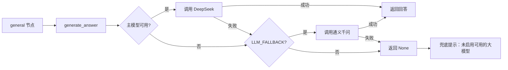

# 模型网关：DeepSeek + 通义千问 双模型路由与降级

## 设计

- 默认主模型 `LLM_PROVIDER=deepseek`，可切换为 `qwen`（通义千问 DashScope OpenAI 兼容模式）；
- 主模型不可用（未配置 Key）或调用异常时，`LLM_FALLBACK=true` 会自动降级到备用模型；
- 所有提供商均不可用时返回 `None`，由 graph 的 general 节点兜底提示；
- 对外接口保持 `generate_answer(system_prompt, user_message)` 不变，编排层无感。

## 环境变量

| 变量 | 默认 | 说明 |
| --- | --- | --- |
| `LLM_PROVIDER` | `deepseek` | 首选模型：`deepseek` / `qwen` |
| `LLM_FALLBACK` | `true` | 主模型失败时是否降级备用模型 |
| `DEEPSEEK_ENABLED` | `false` | 是否启用 DeepSeek |
| `DEEPSEEK_API_KEY` | - | DeepSeek API Key |
| `DEEPSEEK_MODEL` | `deepseek-chat` | DeepSeek 模型名 |
| `DEEPSEEK_BASE_URL` | `https://api.deepseek.com` | DeepSeek 网关地址 |
| `QWEN_API_KEY` | - | 通义千问 DashScope API Key |
| `QWEN_MODEL` | `qwen-plus` | 通义千问模型名 |
| `QWEN_BASE_URL` | `https://dashscope.aliyuncs.com/compatible-mode/v1` | DashScope OpenAI 兼容端点 |

## 调用流程

## 测试

`tests/test_model_gateway.py` 覆盖：无提供商返回 None、默认路由 DeepSeek、
DeepSeek 故障降级通义千问、关闭降级后失败返回 None、仅配置通义千问时路由。