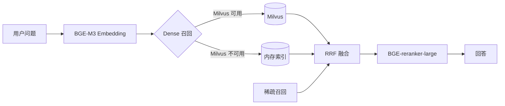

# RAG 向量存储：Milvus 接入与降级策略

## 背景

知识库检索采用「稠密 + 稀疏 + RRF 融合 + 重排序」的混合检索链路：

- 稠密召回：本地 BGE-M3 生成 1024 维向量；
- 稀疏召回：词法重叠打分（RAGRetriever）；
- RRF 融合两路召回，BGE-reranker-large 重排序。

知识规模增长后，纯内存索引存在上限。新增 Milvus 向量库作为稠密召回后端，
向量索引外置后可横向扩展，同时保留内存镜像保证可用性。

## 架构



## 配置

| 环境变量 | 默认值 | 说明 |
| --- | --- | --- |
| `RAG_VECTOR_STORE` | `auto` | `auto` Milvus 可用时自动启用；`milvus` 强制优先；`memory` 仅内存索引 |
| `MILVUS_URI` | `http://localhost:19530` | Milvus 服务地址 |
| `MILVUS_COLLECTION` | `hzt_knowledge_chunks` | 集合名，不存在时自动创建 |
| `MILVUS_DIM` | `1024` | 稠密向量维度（BGE-M3） |

集合 Schema：`chunk_id`（主键）、`document_id`、`tenant_id`、`content`、`dense_vector`，
索引为 HNSW + COSINE，支持按租户过滤与按文档删除。

## 降级策略

1. 首次入库时探测 Milvus（`count()`）；连接失败则整个会话降级为内存索引，
   避免每次请求反复重连。
2. 内存索引始终镜像全部切片：即使 Milvus 可用，写入也同步内存，降级不丢数据。
3. 检索或写入过程中 Milvus 异常，立即降级并记录 `warning`，接口不受影响。
4. embedding / reranker 模型不可用时，再降级为纯稀疏检索，链路始终可用。

## 验证

本地未启动 Milvus 时，启动日志应出现：

```
Milvus 不可用（Milvus 连接失败: http://localhost:19530），本次会话降级为内存向量索引
```

此时知识问答接口正常返回；本地按 Milvus 官方 standalone 部署（默认 19530 端口）后
重启 agent-runtime，将自动创建集合并切换为 Milvus 稠密召回。

## 测试

`tests/test_milvus_store.py` 覆盖写入行构造与删除表达式；
`tests/test_knowledge_milvus_fallback.py` 覆盖 Milvus 不可用时自动降级内存索引。